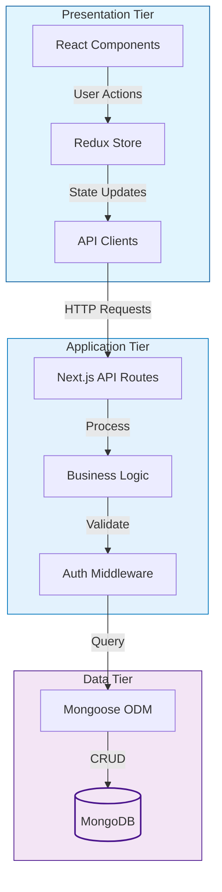

# 🛍️ EasyShop - Modern E-commerce Platform

[](https://nextjs.org/)
[](https://www.typescriptlang.org/)
[](https://www.mongodb.com/)
[](https://redux.js.org/)
[](LICENSE)

EasyShop is a modern, full-stack e-commerce platform built with Next.js 14, TypeScript, and MongoDB. It features a beautiful UI with Tailwind CSS, secure authentication, real-time cart updates, and a seamless shopping experience.

## ✨ Features

- 🎨 Modern and responsive UI with dark mode support
- 🔐 Secure JWT-based authentication
- 🛒 Real-time cart management with Redux
- 📱 Mobile-first design approach
- 🔍 Advanced product search and filtering
- 💳 Secure checkout process
- 📦 Multiple product categories
- 👤 User profiles and order history
- 🌙 Dark/Light theme support

## 🏗️ Architecture

EasyShop follows a three-tier architecture pattern:

### 1. Presentation Tier (Frontend)
- Next.js React Components
- Redux for State Management
- Tailwind CSS for Styling
- Client-side Routing
- Responsive UI Components

### 2. Application Tier (Backend)
- Next.js API Routes
- Business Logic
- Authentication & Authorization
- Request Validation
- Error Handling
- Data Processing

### 3. Data Tier (Database)
- MongoDB Database
- Mongoose ODM
- Data Models
- CRUD Operations
- Data Validation



### Key Features of the Architecture
- **Separation of Concerns**: Each tier has its specific responsibilities
- **Scalability**: Independent scaling of each tier
- **Maintainability**: Modular code organization
- **Security**: API routes handle authentication and data validation
- **Performance**: Server-side rendering and static generation
- **Real-time Updates**: Redux for state management

### Data Flow
1. User interacts with React components
2. Actions are dispatched to Redux store
3. API clients make requests to Next.js API routes
4. API routes process requests through middleware
5. Business logic handles data operations
6. Mongoose ODM interacts with MongoDB
7. Response flows back through the tiers

## 🚀 Getting Started

### Docker Setup Guide

This guide will help you run EasyShop using Docker containers. No local Node.js or MongoDB installation required!

### Prerequisites

1. Install [Docker](https://docs.docker.com/get-docker/) on your machine
2. Basic understanding of terminal/command line

### Step 1: Environment Setup

1. Create a file named `.env.local` in the root directory with the following content:
```env
# Database Configuration
MONGODB_URI=mongodb://easyshop-mongodb:27017/easyshop

# NextAuth Configuration
NEXTAUTH_URL=http://localhost:3000  # Replace with your EC2 instance's public IP or put localhost:3000
NEXT_PUBLIC_API_URL=http://localhost:3000/api  # Replace with your EC2 instance's public IP or put localhost:3000/api
NEXTAUTH_SECRET=your-nextauth-secret-key  # Generate this using the command below

# JWT Configuration
JWT_SECRET=your-jwt-secret-key  # Generate this using the command below
```

> [!IMPORTANT]
> When deploying to EC2, make sure to replace `your-ec2-ip` with your actual EC2 instance's public IP address.

To generate secure secret keys, use these commands in your terminal:
```bash
# For NEXTAUTH_SECRET
openssl rand -base64 32

# For JWT_SECRET
openssl rand -hex 32
```

### Step 2: Running the Application

You have two options to run the application:

#### Option 1: Using Docker Compose (Recommended)

This is the easiest way to run the application. All services will be started in the correct order with proper dependencies.

```bash
# Start all services
docker compose up -d

# View logs
docker compose logs -f

# Stop all services
docker compose down
```

#### Option 2: Manual Docker Commands

If you prefer more control, you can run each service manually:

1. Create a Docker network:
```bash
docker network create easyshop-network
```

2. Start MongoDB:
```bash
docker run -d \
  --name easyshop-mongodb \
  --network easyshop-network \
  -p 27017:27017 \
  -v mongodb_data:/data/db \
  mongo:latest
```

3. Build the main application:
```bash
docker build -t easyshop .
```

4. Build and run data migration:
```bash
# Build migration image
docker build -t easyshop-migration -f scripts/Dockerfile.migration .

# Run migration
docker run --rm \
  --network easyshop-network \
  --env-file .env.local \
  easyshop-migration
```

5. Start the EasyShop application:
```bash
docker run -d \
  --name easyshop \
  --network easyshop-network \
  -p 3000:3000 \
  --env-file .env.local \
  easyshop:latest
```

### Accessing the Application

1. Open your web browser
2. Visit [http://localhost:3000](http://localhost:3000)
3. You should see the EasyShop homepage!

### Useful Docker Commands

```bash
# View running containers
docker ps

# View container logs
docker logs easyshop
docker logs easyshop-mongodb

# Stop containers
docker stop easyshop easyshop-mongodb

# Remove containers
docker rm easyshop easyshop-mongodb

# Remove network
docker network rm easyshop-network
```

### Troubleshooting

1. If you can't connect to MongoDB:
   - Make sure the MongoDB container is running: `docker ps`
   - Check MongoDB logs: `docker logs easyshop-mongodb`
   - Verify network connection: `docker network inspect easyshop-network`

2. If the application isn't accessible:
   - Check if the container is running: `docker ps`
   - View application logs: `docker logs easyshop`
   - Make sure port 3000 isn't being used by another application

3. If migration fails:
   - Check if MongoDB is running and accessible
   - View migration logs when running the migration command
   - Verify your .env.local file has the correct MongoDB URI

For any other issues, please create a GitHub issue with the error details.

## 🧪 Testing

> [!NOTE]
> Coming soon: Unit tests and E2E tests with Jest and Cypress

## 🔧 Troubleshooting

### Build Errors

1. **Dynamic Server Usage Warnings**
```bash
Error: Dynamic server usage: Page couldn't be rendered statically
```
**Solution**: This is expected behavior for dynamic routes and API endpoints. These warnings appear during build but won't affect the application's functionality.

2. **MongoDB Connection Issues**
```bash
Error: MongoDB connection failed
```
**Solution**: 
- Ensure MongoDB is running locally
- Check if your MongoDB connection string is correct in `.env.local`
- Try connecting to MongoDB using MongoDB Compass with the same connection string

### Development Tips
- Clear `.next` folder if you encounter strange build issues: `rm -rf .next`
- Run `npm install` after pulling new changes
- Make sure all environment variables are properly set
- Use Node.js version 18 or higher

## 📦 Project Structure

```
easyshop/
├── src/
│   ├── app/              # Next.js App Router pages
│   ├── components/       # Reusable React components
│   ├── lib/             # Utilities and configurations
│   │   ├── auth/        # Authentication logic
│   │   ├── db/          # Database configuration
│   │   └── features/    # Redux slices
│   ├── types/           # TypeScript type definitions
│   └── styles/          # Global styles and Tailwind config
├── public/              # Static assets
└── scripts/            # Database migration scripts
```

## 🤝 Contributing

We welcome contributions! Please follow these steps:

1. Fork the repository
2. Create a new branch: `git checkout -b feature/amazing-feature`
3. Make your changes
4. Run tests: `npm test` (coming soon)
5. Commit your changes: `git commit -m 'Add amazing feature'`
6. Push to the branch: `git push origin feature/amazing-feature`
7. Open a Pull Request

> [!TIP]
> Check our [Contributing Guidelines](CONTRIBUTING.md) for more details

## 📝 License

This project is licensed under the MIT License - see the [LICENSE](LICENSE) file for details.

## 🙏 Acknowledgments

- [Next.js](https://nextjs.org/)
- [Tailwind CSS](https://tailwindcss.com/)
- [MongoDB](https://www.mongodb.com/)
- [Redux Toolkit](https://redux-toolkit.js.org/)
- [Radix UI](https://www.radix-ui.com/)

## 📫 Contact

For questions or feedback, please open an issue or contact the maintainers:

- Maintainer - [@zehan12](https://github.com/zehan12)
- Project Link: [https://github.com/zehan12/easyshop-ecommerce](https://github.com/zehan12/easyshop-ecommerce)

---

<div align="center">
  <p>
    Made with ❤️ by <a href="https://zehankhan.vercel.app/" target="_blank"><b>Zehan Khan</b></a>
  </p>
</div>


# EasyShop Deployment

## Architecture Overview

EasyShop is deployed using a GitOps approach with the following components:

1. **Jenkins Pipeline**: Handles CI/CD, infrastructure deployment, and ArgoCD setup
2. **Terraform**: Manages AWS infrastructure (VPC, EKS, IAM)
3. **ArgoCD**: Manages application deployment using GitOps
4. **Kubernetes**: Runs the application and supporting services
5. **Monitoring**: Prometheus and Grafana for observability

## Deployment Flow

1. Jenkins pipeline is triggered by code changes
2. Docker images are built and pushed to Docker Hub
3. Terraform deploys or updates AWS infrastructure
4. ArgoCD is installed on the EKS cluster
5. ArgoCD applications are created to deploy EasyShop and monitoring
6. ArgoCD syncs the applications from the Git repository

## Key Files

- **Jenkinsfile**: Main CI/CD pipeline definition
- **terraform/**: Infrastructure as Code for AWS resources
- **kubernetes/**: Kubernetes manifests for application deployment
- **kubernetes/argocd/**: ArgoCD application definitions
- **scripts/**: Utility scripts for deployment and management

## Important Notes

- ArgoCD installation is managed exclusively by the Jenkins pipeline
- Infrastructure is managed by Terraform
- Application deployment is managed by ArgoCD
- Secrets should be managed using AWS Secrets Manager or Kubernetes secrets

## Local Development

For local development, you can use:

```bash
# Start a local Kubernetes cluster
kind create cluster --name easyshop

# Deploy the application locally
kubectl apply -f kubernetes/
```
